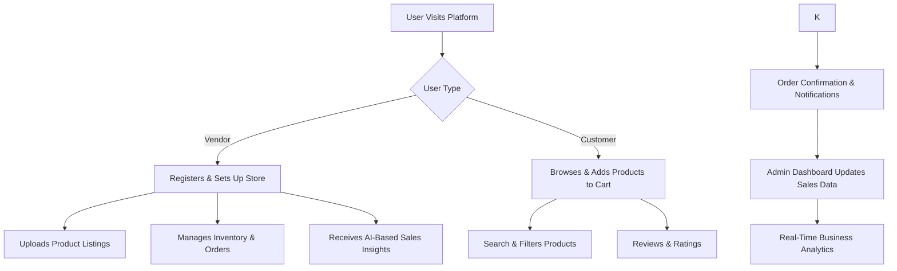

# EzyBiz - AI-Powered Digital Business & E-Commerce Platform

## Overview
EzyBiz is a scalable and secure e-commerce platform designed to help local vendors expand their businesses online. It provides a user-friendly interface for customers while ensuring secure transactions and efficient store management for vendors.

---

## Project Goals
### For Vendors
- **Product Listings:** Easily list products with descriptions, images, and pricing.
- **Vendor Panel:** Manage inventory, orders, and store settings.

### For Customers
- **Shopping Cart & Checkout:** Secure and seamless purchase experience.
- **Search & Filter:** Intuitive search for better product discoverability.
- **Customer Engagement:** Product reviews, ratings, and notifications.

### For Admins
- **Admin Dashboard:** Insights, analytics, and user/product management.

---

## Security & Transactions
- **Secure Authentication:** JWT/OAuth for safe user logins.

---

## System Workflow


---

## Key Technologies Used
| Technology      | Usage |
|---------------|--------|
| **Frontend**  | HTML, CSS, JavaScript, React (for a responsive UI) |
| **Backend**   | Node.js (Express) / Flask |
| **Database**  | MongoDB |
| **Authentication** | JWT / OAuth (for secure user management) |


---

## Installation & Setup
### Prerequisites
Ensure you have the following installed:
- Node.js (for backend)
- MongoDB/MySQL (for database)
- React.js (for frontend)

### Clone the Repository
```bash
git clone https://github.com/YOUR_USERNAME/EzyBiz.git  
cd EzyBiz  
```

### Backend Setup
```bash
cd backend  
npm install  
npm start  
```
Ensure your database is running before starting the backend.

### Frontend Setup
```bash
cd frontend  
npm install  
npm start  
```

---

## Project Outcomes
- **Improved Vendor Reach:** Enables vendors to expand their business digitally.
- **Enhanced Customer Experience:** A seamless UI with secure payments and personalized recommendations.
- **Data-Driven Insights:** Admins can leverage real-time analytics to make informed business decisions.
- **Scalability & Security:** The platform is designed to handle high traffic loads while ensuring data privacy.

---

## Future Enhancements
- **AI-Powered Product Recommendations:** Personalized suggestions based on user behavior.
- **Social Media Integrations:** Enabling vendors to promote products easily.
- **Progressive Web App (PWA) Version:** Optimized mobile experience.

---

## Contributing
Contributions are welcome! To contribute:
1. Fork the repository.
2. Create a new branch (`feature-branch`).
3. Commit changes and push.
4. Open a Pull Request.

---

© 2025 EzyBiz. Empowering Small Businesses with AI.

### Our Website


